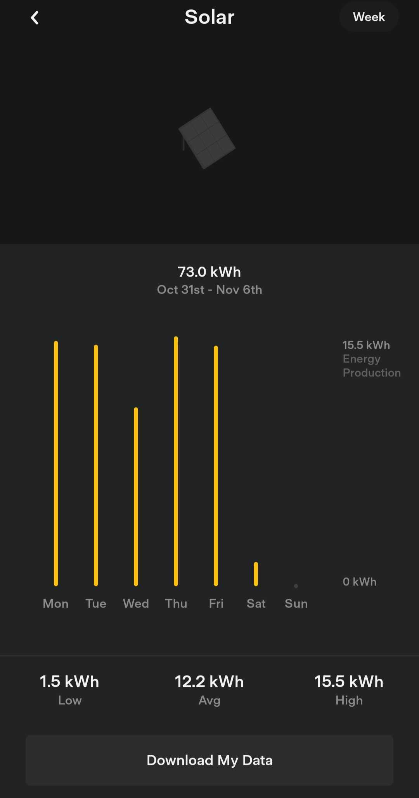

# Predicting How Much Money Tesla Owes Us
## Using Tesla Solar Energy Data, Our Power Bill, and Historical Daylength Data for Our Local Area
<br>

<table width = "100%">
    <tr>
        <td>
             
        </td>
        <td>
            
        </td>
        <td>
            
        </td>
    </tr>
</table>

**Daylength Data Source:** https://sunrise.maplogs.com/palm_springs_ca_usa.83480.html

### TOC

1. Pre-Processing

    a. [Solar Data Pre-Processing](https://github.com/nickmccarty/solar-energy-predictor/blob/main/notebooks/1%20-%20pre-processing/a%20-%20Solar%20Data%20Pre-Processing.ipynb)
    
    b. [Sunlight Duration Data Pre-Processing](https://github.com/nickmccarty/solar-energy-predictor/blob/main/notebooks/1%20-%20pre-processing/b%20-%20Sunlight%20Duration%20Data%20Pre-Processing.ipynb)
    
    c. [Merging Dataframes](https://github.com/nickmccarty/solar-energy-predictor/blob/main/notebooks/1%20-%20pre-processing/c%20-%20Merging%20Dataframes.ipynb)
    
2. Analysis

    a. [Solar EDA](https://github.com/nickmccarty/solar-energy-predictor/blob/main/notebooks/2%20-%20analysis/a%20-%20Solar%20EDA.ipynb)
    
    b. [Sunlight Duration EDA](https://github.com/nickmccarty/solar-energy-predictor/blob/main/notebooks/2%20-%20analysis/b%20-%20Sunlight%20Duration%20EDA.ipynb)
    
    c. [Energy Cost EDA](https://github.com/nickmccarty/solar-energy-predictor/blob/main/notebooks/2%20-%20analysis/c%20-%20Energy%20Cost%20EDA.ipynb)
    
    d. [Combined EDA](https://github.com/nickmccarty/solar-energy-predictor/blob/main/notebooks/2%20-%20analysis/d%20-%20Combined%20EDA.ipynb)
    
3. Modeling

    a. [Feature Selection](https://github.com/nickmccarty/solar-energy-predictor/blob/main/notebooks/3%20-%20modeling/a%20-%20Feature%20Selection.ipynb)
    
    b. [Feature Transformation](https://github.com/nickmccarty/solar-energy-predictor/blob/main/notebooks/3%20-%20modeling/b%20-%20Feature%20Transformation.ipynb)
    
    c. [ARIMA](https://github.com/nickmccarty/solar-energy-predictor/blob/main/notebooks/3%20-%20modeling/c%20-%20ARIMA.ipynb)

### Tesla's Guaranteed kWh and Price/kWh


### Working Directory Structure

```
.
├── README.md
├── data
│   ├── interim
│   │   ├── combined-solar-data.csv
│   │   └── combined-sunlight-duration-data.csv
│   ├── processed
│   │   ├── resampled_merged_data.csv
│   │   ├── solar_and_daylength_data.csv
│   │   ├── solar_data.csv
│   │   └── sunlight_duration_in_decimal_hrs.csv
│   └── raw
│       ├── energy-costs.csv
│       ├── solar
│       │   ├── 1.10-1.16.csv
│       │   ├── 1.17-1.23.csv
│       │   ├── 1.24-1.30.csv
│       │   ├── 1.3-1.9.csv
│       │   ├── 1.31-2.6.csv
│       │   ├── 10.10-10.16.csv
│       │   ├── 10.17-10.23.csv
│       │   ├── 10.24-10.30.csv
│       │   ├── 10.3-10.9.csv
│       │   ├── 10.31-11.6.csv
│       │   ├── 11.1-11.7.csv
│       │   ├── 11.15-11.21.csv
│       │   ├── 11.22-11.28.csv
│       │   ├── 11.29-12.5.csv
│       │   ├── 11.8-11.14.csv
│       │   ├── 12.13-12.19.csv
│       │   ├── 12.20-12.26.csv
│       │   ├── 12.27-1.2.csv
│       │   ├── 12.6-12.12.csv
│       │   ├── 2.14-2.20.csv
│       │   ├── 2.21-2.27.csv
│       │   ├── 2.28-3.6.csv
│       │   ├── 2.7-2.13.csv
│       │   ├── 3.14-3.20.csv
│       │   ├── 3.21-3.27.csv
│       │   ├── 3.28-4.3.csv
│       │   ├── 3.7-3.13.csv
│       │   ├── 4.11-4.17.csv
│       │   ├── 4.18-4.24.csv
│       │   ├── 4.25-5.1.csv
│       │   ├── 4.4-4.10.csv
│       │   ├── 5.16-5.22.csv
│       │   ├── 5.2-5.8.csv
│       │   ├── 5.23-5.29.csv
│       │   ├── 5.30-6.5.csv
│       │   ├── 5.9-5.15.csv
│       │   ├── 6.13-6.19.csv
│       │   ├── 6.20-6.26.csv
│       │   ├── 6.27-7.3.csv
│       │   ├── 6.6-6.12.csv
│       │   ├── 7.11-7.17.csv
│       │   ├── 7.18-7.24.csv
│       │   ├── 7.25-7.31.csv
│       │   ├── 7.4-7.10.csv
│       │   ├── 8.1-8.7.csv
│       │   ├── 8.15-8.21.csv
│       │   ├── 8.22-8.28.csv
│       │   ├── 8.29-9.4.csv
│       │   ├── 8.8-8.14.csv
│       │   ├── 9.12-9.18.csv
│       │   ├── 9.19-9.25.csv
│       │   ├── 9.26-10.2.csv
│       │   └── 9.5-9.11.csv
│       ├── sunlight-duration-2021.csv
│       └── sunlight-duration-2022.csv
├── images
│   ├── daylength-data-screenshot.jpg
│   ├── power-bill-screenshot.jpg
│   ├── tesla-app-screenshot.jpg
│   └── tesla-solar-agreement-screenshot.jpg
└── notebooks
    ├── 1 - pre-processing
    │   ├── a - Solar Data Pre-Processing.ipynb
    │   ├── b - Sunlight Duration Data Pre-Processing.ipynb
    │   └── c - Merging Dataframes.ipynb
    ├── 2 - analysis
    │   ├── a - Solar EDA.ipynb
    │   ├── b - Sunlight Duration EDA.ipynb
    │   ├── c - Energy Cost EDA.ipynb
    │   └── d - Combined EDA.ipynb
    └── 3 - modeling
        ├── a - Feature Selection.ipynb
        ├── b - Feature Transformation.ipynb
        └── c - ARIMA.ipynb
```
